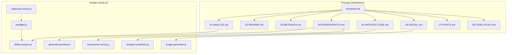
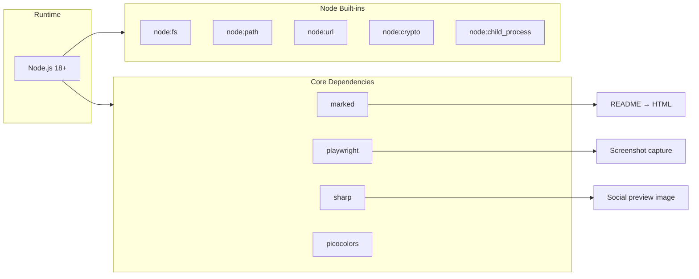

# Git Launcher — Architecture

Git Launcher is a collection of Node.js scripts and Markdown prompts that work together inside an AI IDE. There is no web server or persistent process — the agent reads the prompts and orchestrates the scripts.

## Component Architecture

### Script Responsibilities

| Script | Purpose |
|--------|---------|
| `detect-project.js` | Scans package.json / config to infer language, framework, dependencies, entry point |
| `preflight.js` | Installs deps, runs security checks, detects project, outputs JSON for the agent |
| `analyze-codebase.js` | Parses source files for imports and produces Mermaid-ready nodes/edges |
| `screenshot-runner.js` | Captures desktop/tablet/mobile screenshots (or uses `--preview` for CLI projects) |
| `generate-preview.js` | Renders README + launch kit into HTML for screenshot capture |
| `image-generator.js` | Renders 1200x630 social preview PNG using Sharp |
| `staleness-check.js` | Compares production/ fingerprint with git-launch/ to detect out-of-date assets |

## Technology Stack

### Data Flow

1. **Preflight** — Agent runs `preflight.js`. Output JSON (project name, language, framework, etc.) is used by all later steps.
2. **Analysis** — Agent runs `detect-project.js` and `analyze-codebase.js` to understand the project structure.
3. **Generation** — Agent writes files to `git-launch/` using the prompts as templates and the analysis as context.
4. **Screenshots** — For web apps: agent runs `screenshot-runner.js --port N`. For CLI: runs `screenshot-runner.js --preview` (generates HTML from README, then screenshots it).
5. **Social Image** — Agent runs `image-generator.js` with project name, tagline, and tech stack.
6. **Fingerprint** — After a full run, `staleness-check.js --write` stamps `git-launch/.fingerprint` so future runs can detect if production/ has changed.

### Key Design Decisions

- **Prompt-driven** — The agent follows Markdown prompts; no custom DSL or config file. Each prompt is self-contained.
- **Production folder** — The shippable product lives in `production/`. The agent analyzes and describes only that folder, not dev tooling.
- **CLI-friendly** — Projects without a web UI use a generated preview page (README → HTML) for screenshots instead of requiring a running server.
- **No cloud** — Everything runs locally. Playwright, Sharp, and Marked are used for screenshots and image generation; no external APIs.
